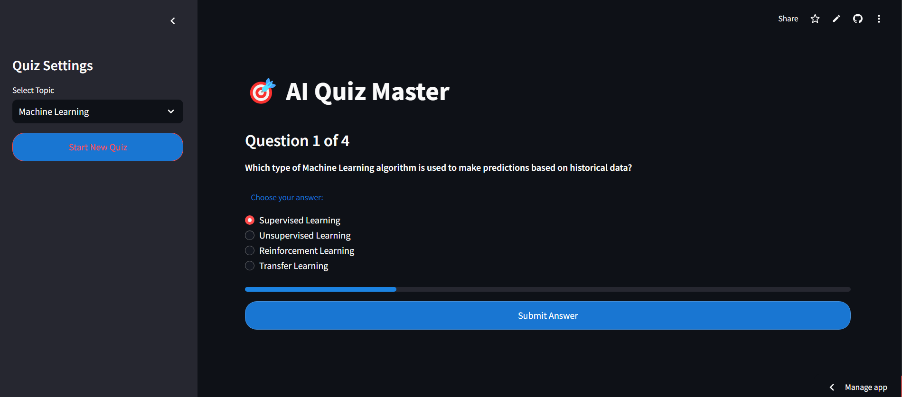
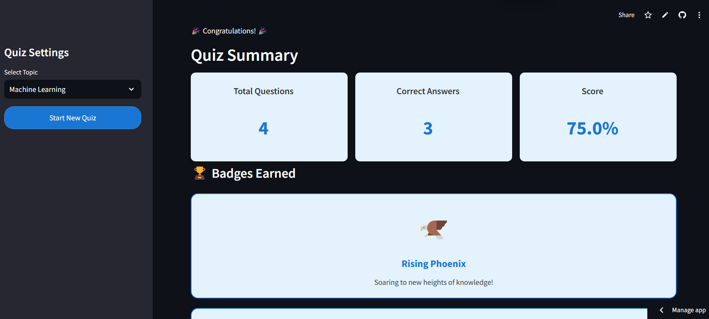
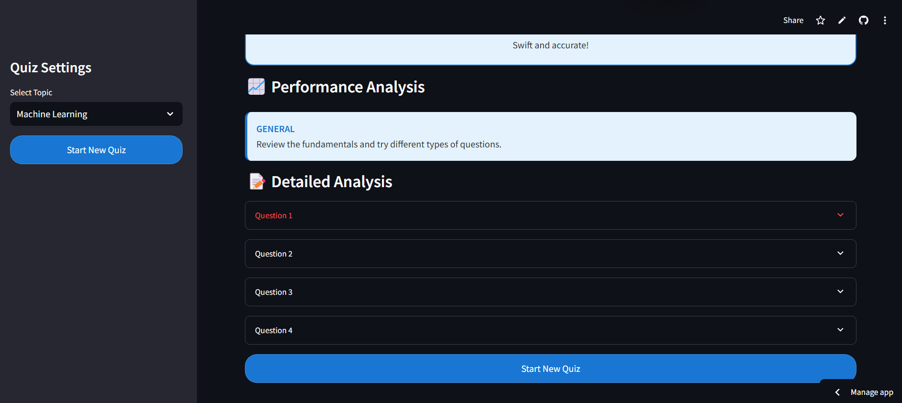
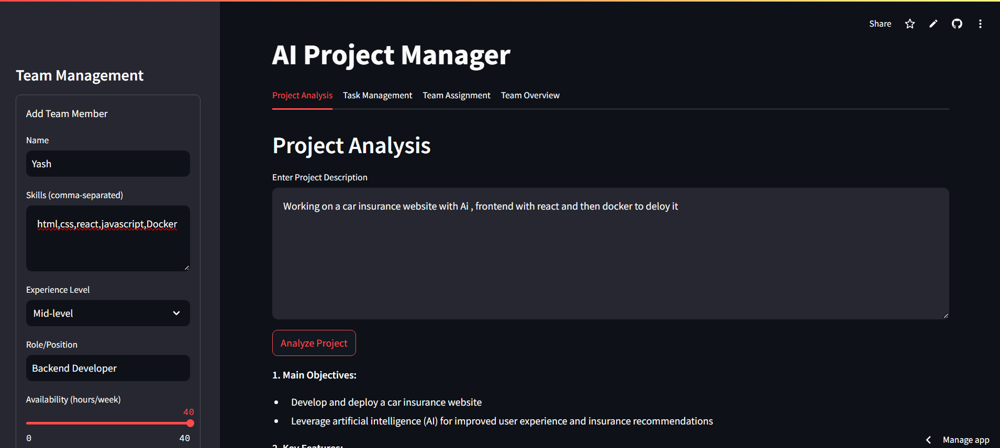
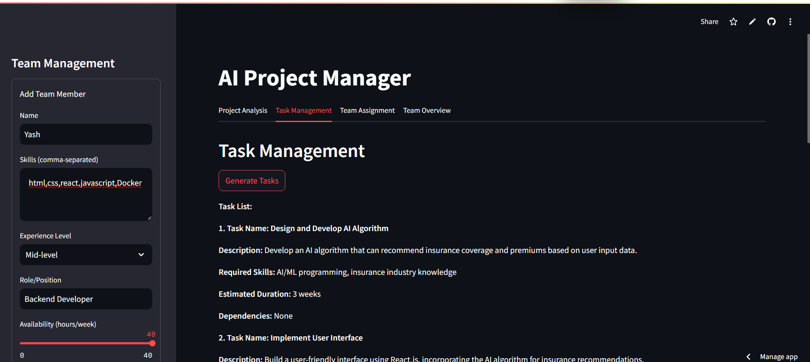
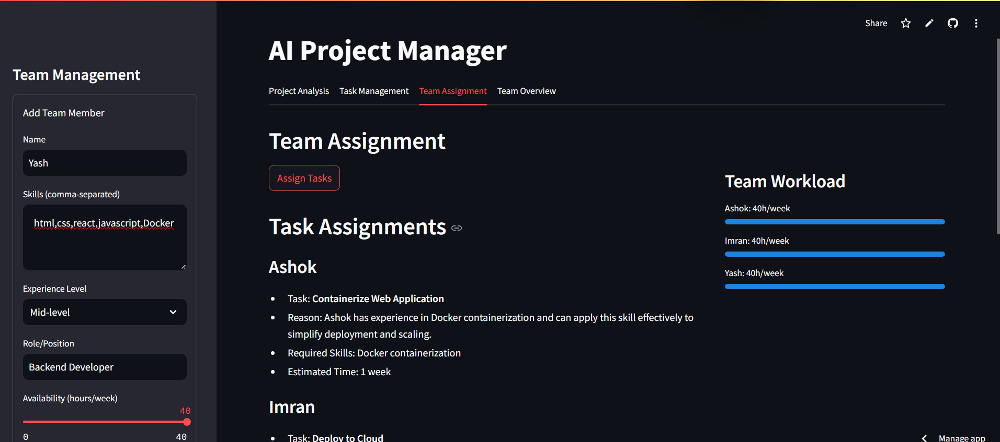
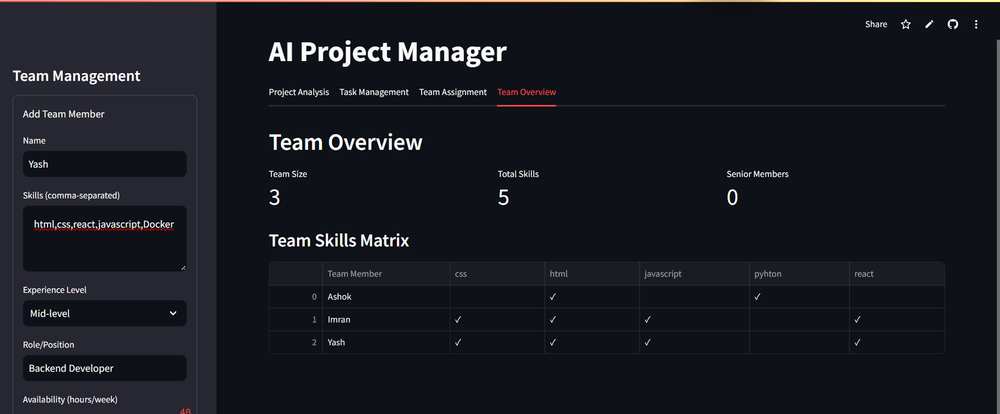

# UpScale - It's Never Late to Raise the Bar

## Overview

**UpScale** is a cutting-edge project that leverages Artificial Intelligence (AI) to provide personalized learning experiences tailored to workplace environments. It empowers employees to enhance their skills through personalized roadmaps, AI-curated courses, and interactive features. Simultaneously, it equips managers with powerful tools for task management and monitoring. UpScale integrates Machine Learning, Deep Learning, Reinforcement Learning, Generative AI, LangChain, CrewAI, and AI agents to deliver an AI-driven web solution.


---

## Key Features

### For Employees:

#### 1. Roadmap Generator

- **Description**: A tool that creates personalized skill enhancement roadmaps based on the employee’s skills, role, current projects, and career goals.
- **Technologies**: Reinforcement Learning, Gemini API, Streamlit.
- **Functionality**:
  - Utilizes Reinforcement Learning to adaptively refine roadmaps based on user feedback and learning progress.
  - Collects input data from users (skills, role, goals, feedback).
  - Generates a tailored roadmap optimized for achieving career milestones.
  - Updates the roadmap based on feedback for continuous improvement.
- **Images**:
  <div style="display: flex;">
    
    
    
    
  </div>

#### 2. YouTube University

- **Description**: A distraction-free learning platform that integrates YouTube API to provide courses aligned with the personalized roadmap.
- **Technologies**: YouTube API, React.js.
- **Functionality**:
  - Displays curated courses based on the user’s roadmap.
  - Provides a distraction-free interface to focus on learning.
- **Images**:
  <div style="display: flex;">
    
    
  </div>

#### 3. Quiz Time

- **Description**: AI-generated quizzes to test knowledge, with adaptive difficulty levels and detailed feedback.
- **Technologies**: LangChain, Gemini API, Streamlit.
- **Functionality**:
  - Generates dynamic quizzes based on the user’s selected courses.
  - Adjusts difficulty based on real-time performance.
  - Awards badges for performance that can be added to profiles.
  - Provides actionable feedback for improvement.
- **Images**:
  <div style="display: flex;">
    
    
    
  </div>

#### 4. Project Course

- **Description**: A feature enabling managers to assign mandatory courses or project-specific training to employees.
- **Technologies**: Flask framework.
- **Functionality**:
  - Managers upload courses such as negotiation, gender sensitization, or project-related technical skills.
  - Employees view and complete assigned courses.
  - **Test Credentials for Employees**:
    - Email: [bob@example.com](mailto:bob@example.com)
    - Password: password124
- **Images**:
  <div style="display: flex;">
    
    
  </div>

---

### For Managers:

#### 1. Manager Task Management

- **Description**: A comprehensive AI-powered task management solution.
- **Technologies**: CrewAI, AI Agents, Gemini API, LangChain, Streamlit.
- **Functionality**:
  - One AI agent analyzes project descriptions.
  - Another AI agent breaks projects into tasks.
  - A third agent allocates tasks to employees.
- **Images**:
  <div style="display: flex;">
    
    
    
    
  </div>

#### 2. Status Dashboard

- **Description**: A unified dashboard for monitoring employee progress, project statuses, and task completion.
- **Technologies**: Flask framework.
- **Functionality**:
  - Aggregates data from employees, projects, and tasks.
  - Displays real-time progress updates.
  - Allows employees to edit and update progress.
- **Images**:
  <div style="display: flex;">
    
    
  </div>

#### 3. Project Course

- **Description**: Managers assign mandatory and project-specific courses to employees.
- **Functionality**:
  - Similar to the employee-side implementation but with additional managerial controls.
  - **Test Credentials for Managers**:
    - Email: [manager@example.com](mailto:manager@example.com)
    - Password: password123
- **Images**:
  <div style="display: flex;">
    
  </div>

---

### Forum

- **Description**: A community-driven space for employees to ask and answer questions, with features for upvotes and downvotes.
- **Technologies**: Flask framework.
- **Functionality**:
  - Employees post questions.
  - Community members provide answers.
  - Voting system ensures the best answers surface.
- **Images**:
  <div style="display: flex;">
    
  </div>

---

### AI-Driven Features

#### AI-Powered Analytics

- **Description**: Provides detailed insights into employee learning patterns, task progress, and overall performance.
- **Technologies**: Machine Learning, Generative AI.
- **Functionality**:
  - Tracks learning engagement and completion rates.
  - Generates reports for both employees and managers.
  - Offers predictive analytics for skill gaps and career growth.

#### Adaptive AI Agent

- **Description**: Acts as a virtual assistant for both employees and managers.
- **Technologies**: LangChain, AI Agents.
- **Functionality**:
  - Answers queries related to tasks, projects, and roadmaps.
  - Provides suggestions for skill enhancement.
  - Offers reminders for deadlines and progress updates.

---

## Deployment Details

------


### Backend
- **Tech Stack**: Flask, LangChain, AI Agents, Gemini API.
- **Key Features**:
  - API endpoints for roadmap generation, task management, and analytics.

### Frontend
- **Tech Stack**: React.js, Streamlit, Tailwind CSS.
- **Key Features**:
  - Interactive and user-friendly interfaces for all features.

### Deployment Platform
- **Hosting**: AWS, Heroku.
- **Database**: MongoDB Atlas.

---

## Getting Started

### Prerequisites
1. Install Python 3.9+.
2. Install Node.js 14+.
3. Clone the repository.

### Installation
1. Install backend dependencies:
   ```bash
   pip install -r requirements.txt
   ```
2. Install frontend dependencies:
   ```bash
   npm install
   ```

### Running the Application
1. Start the backend server:
   ```bash
   flask run
   ```
2. Start the frontend server:
   ```bash
   npm start
   ```

---

## License

This project is licensed under the MIT License. See the LICENSE file for details.

